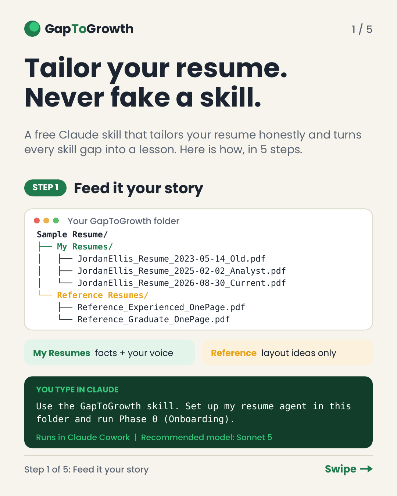
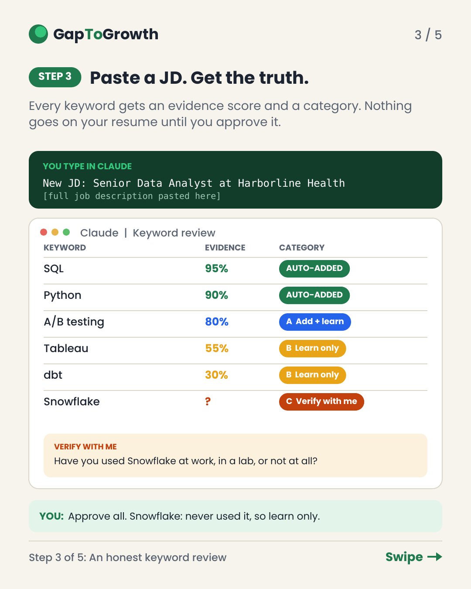
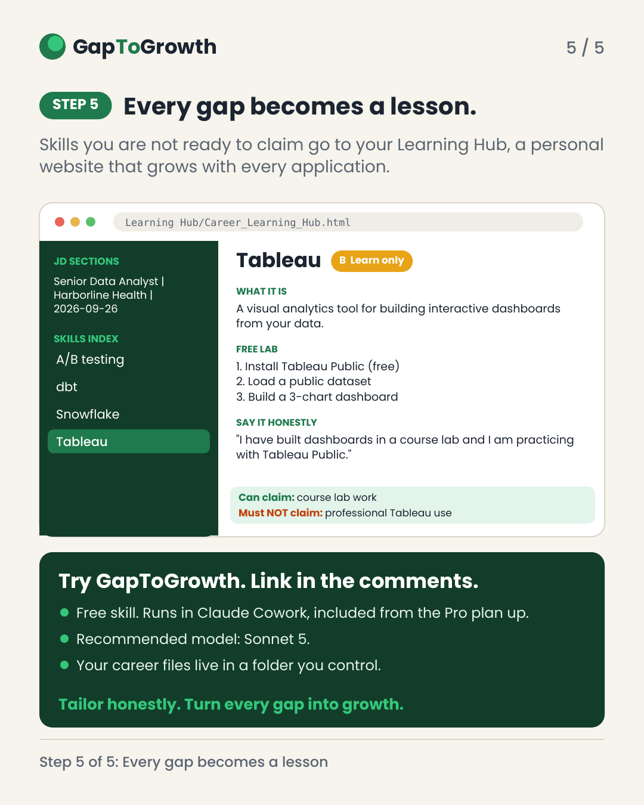
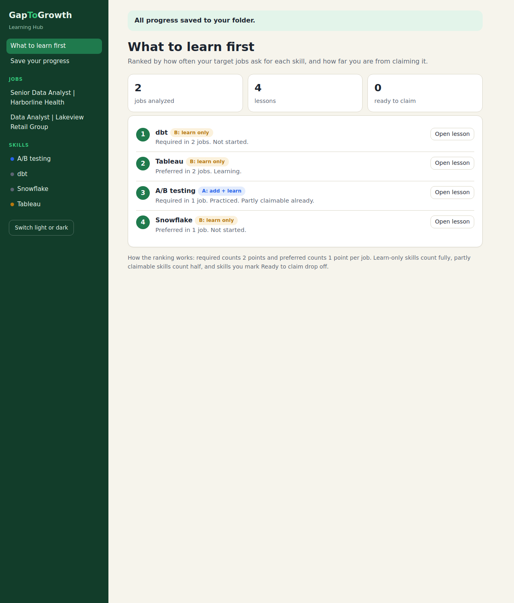
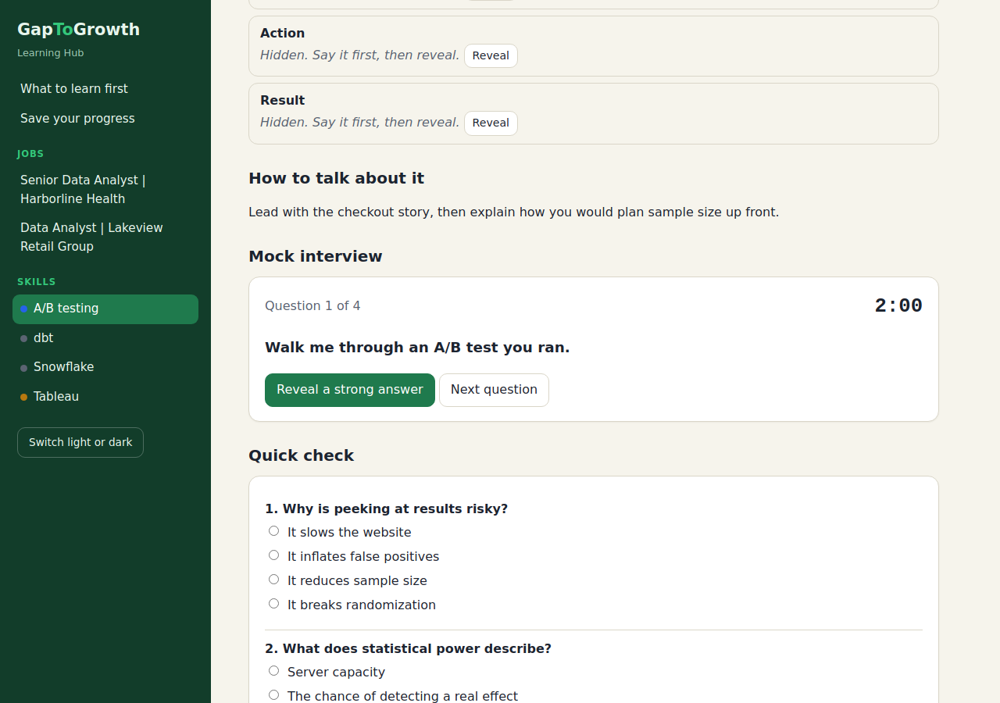

# GapToGrowth 🌱

**Tailor your resume honestly. Turn every gap into growth.**

GapToGrowth is a free Claude skill that tailors your resume to every job description while staying completely honest. It learns your real experience, skills, and writing style from your past resumes, highlights the keywords you can truthfully claim, and checks with you before adding anything it cannot verify. You get a polished, ATS-friendly one-page resume in your own voice, as a Word document first and a PDF once you approve it.

Every skill gap becomes a chance to grow. GapToGrowth builds a personal **Learning Hub** that ranks your top skill gaps across all your applications and lets you practice each one with flashcards, hands-on labs, quizzes, story rehearsal, and timed mock interviews.

<p align="center">
  
  
  
</p>

Version 1.1.0 · [5-step walkthrough (PDF)](assets/carousel/GapToGrowth_Carousel.pdf) · [Try the Learning Hub demo](examples/learning-hub-demo)

---

## How it works

| Step | What happens | You say |
|---|---|---|
| **1. Feed it your story** | Add your past resumes, plus optional layout references from friends. GapToGrowth sets up your folder and asks your name and target roles. | The kickoff prompt |
| **2. It learns you** | It reads every resume once, builds your career knowledge base and Writing Style DNA, scores every skill, and asks one batch of questions. | `Start Phase 1.` |
| **3. Paste a JD** | Every keyword gets an evidence score, whether the job requires or prefers it, and a category: **Auto-added** (90%+), **A** add + learn, **B** learn only, **C** verify with me. | `New JD: [Role] at [Company]` + the JD |
| **4. Word first, PDF on your OK** | A one-page resume in your voice, saved as Word. The PDF is created only after you approve. | `Looks good, generate the PDF.` |
| **5. Every gap becomes a lesson** | A and B skills become lessons in your Learning Hub. Required skills get full lessons; nice-to-haves get short cards you can expand. | Nothing. It updates automatically |

**The honesty rule:** GapToGrowth never adds experience you don't have. If a keyword would help but can't be verified, it asks you first.

---

## The Learning Hub

<p align="center">
  
  
</p>

- **What to learn first:** a dashboard that ranks your skill gaps by how often your target jobs ask for them (required counts double).
- **Practice, not just reading:** flashcards, a lab checklist with copy buttons, a quick quiz, story rehearsal cards, and a 2-minute mock interview for every full lesson.
- **Track your growth:** move each skill from Not started to Learning, Practiced, and Ready to claim. When you mark a skill Ready to claim, GapToGrowth offers, with your OK, to add it to your resume evidence as lab experience. That is the gap turning into growth.
- **Progress that follows you:** progress saves automatically in your browser. One click saves it to your folder so it shows up in any browser, with step-by-step instructions in the hub.
- **Fully offline:** one local HTML file with no external scripts, fonts, or network requests.

---

## Built to save your usage

GapToGrowth is designed so you spend your Claude usage on resumes and new lessons, not on overhead:

- Each session reads a few small index files, never your whole history.
- The Learning Hub app is copied, never regenerated. Each job adds one small content file, so the cost per job stays flat no matter how many you've done.
- The dashboard, flashcards, quizzes, and mock interviews are built by your browser from lessons Claude writes once. Practicing costs nothing.
- Full lessons are written only for skills a job requires. Nice-to-haves get short cards you can expand anytime.
- Before any optional large task, GapToGrowth shows a token estimate and asks first.

---

## Requirements and best fit

GapToGrowth reads and writes files in a folder on your computer, so it runs in **Claude Cowork**, which is included on paid Claude plans only.

| Claude plan | Can run GapToGrowth? | Notes |
|---|---|---|
| Free | ❌ Not fully | You can upload custom skills on Free, but Cowork is not included, so GapToGrowth can't work with your folder. |
| **Pro** | ✅ **Best fit** | The lowest plan that includes Cowork. Sonnet 5 is the default model. |
| Max | ✅ Yes | More usage, useful if you apply to many jobs. |
| Team / Enterprise | ✅ If enabled | Your admin controls whether Cowork and skills are available. |

You also need the **Claude Desktop app** for macOS or Windows, and **Code execution and file creation** turned on in Claude's settings.

> **Cowork is changing.** Anthropic is rolling out a new experience where Cowork is built into Claude. If your message box shows "Chat" and "Cowork" options, select **Cowork**. If it doesn't, just describe your task in any conversation.

### Recommended model: Sonnet 5

Sonnet 5 is the default on Free and Pro plans, so most people don't need to change anything. It handles GapToGrowth's multi-step work well. If a step struggles on a very long resume history, you can try a more capable model if your plan offers one; heavier models use more of your plan's usage.

---

## Install

Pick **one** option. *A listing in the Claude directory (the Discover tab) is coming soon.*

### Option A: Folder template (easiest)

1. Download [`dist/GapToGrowth_Folder_Template.zip`](dist/GapToGrowth_Folder_Template.zip) and unzip it somewhere permanent, such as Documents.
2. Put your resumes in `GapToGrowth/Sample Resume/My Resumes`. Add `Current` to your latest resume's file name.
3. Start a Cowork task in Claude Desktop and give it access to the `GapToGrowth` folder only.
4. Send:
   ```
   Read Instructions/FINAL_PROJECT_INSTRUCTIONS.md, then run Phase 0 (Onboarding).
   ```

### Option B: Claude skill (best for updates)

1. In Claude, make sure **Code execution and file creation** is on (Settings > Capabilities).
2. Upload [`dist/gaptogrowth.skill`](dist/gaptogrowth.skill) in **Customize > Skills** and turn it on.
3. Create an empty folder (for example `Documents/GapToGrowth`), start a Cowork task, and give Claude access to it.
4. Send:
   ```
   Use the GapToGrowth skill. Set up my resume agent in this folder and run Phase 0 (Onboarding).
   ```

*Menu names are current as of October 2026 and may change.*

### Option C: Claude Code

```
/plugin marketplace add SidharthArivarasan/gaptogrowth
/plugin install gaptogrowth@gaptogrowth-marketplace
```

Then run Claude Code inside the folder you want as your workspace and ask it to set up GapToGrowth.

---

## Prompts you'll use

| When | Say |
|---|---|
| Learn your resumes | `Start Phase 1. Do not create any resume.` |
| After answering its questions | `All initial sample resumes have been provided. Treat the Resume Master and Writing Style DNA as finalized.` |
| Every job | `New JD: [Role] at [Company]` followed by the job description |
| Approve the Word file | `Looks good, generate the PDF.` |
| Get tutored on a skill | `Coach me on [skill]` |
| Turn a card into a full lesson | `Expand the [skill] lesson in my Learning Hub.` |
| Get the newest hub design | `Upgrade my Learning Hub` |
| Added a new resume of your own | `I added a new resume.` |

Whenever GapToGrowth needs a choice, it ends with **"Reply with one of:"** and the exact words to send.

---

## Reference resumes included

Two fictional, one-page, ATS-friendly reference resumes, one for experienced professionals and one for recent graduates, show layout best practices. You can also add friends' resumes (with their permission). All references are used for layout ideas only, never as facts about you. See [`examples/reference-resumes`](examples/reference-resumes).

---

## Repository layout

```
gaptogrowth/
├── README.md · LICENSE · CHANGELOG.md
├── .claude-plugin/marketplace.json        Claude Code marketplace catalog
├── plugins/gaptogrowth/                   THE PLUGIN (directory listing source)
│   ├── .claude-plugin/plugin.json
│   ├── README.md · LICENSE
│   └── skills/gaptogrowth/
│       ├── SKILL.md                       the workflow
│       └── references/                    templates, hub app, lesson format, sample resumes
├── dist/                                  gaptogrowth.skill and the folder template zip
├── examples/                              reference resumes and a Learning Hub demo
├── assets/                                carousel and screenshots
└── docs/                                  install, setup, and maintainer guides
```

---

## Privacy

- GapToGrowth is a set of instructions plus a local web page. It has no server, makes no network requests, and collects nothing.
- Your resumes, knowledge files, lessons, and progress live in the folder you choose. Claude processes them under your own Claude account and Anthropic's terms. Cowork sessions may run in the cloud; see Anthropic's Cowork documentation.
- **Never share your filled-in folder.** It contains your career history. Share this repository instead.

## Disclaimer

GapToGrowth is an independent project and is **not affiliated with or endorsed by Anthropic**. It helps you present your real experience; it does not guarantee interviews or offers. Always review every resume before you send it. All example names, companies, schools, and numbers in this repository are fictional.

## Feedback

Open a GitHub Issue. Please never paste real resume content or personal details into an issue.

## License

[MIT](LICENSE) © 2026 Sidharth Arivarasan
